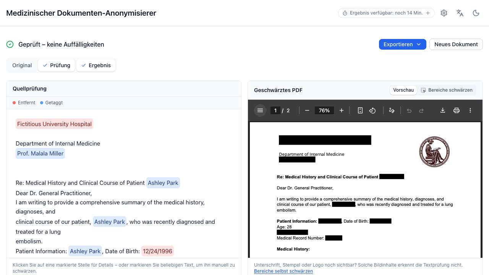
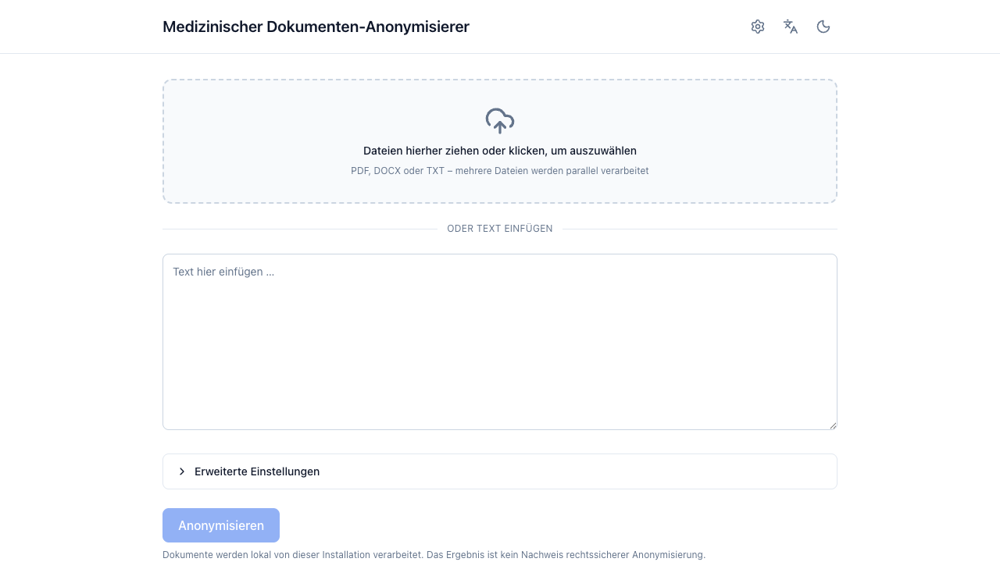
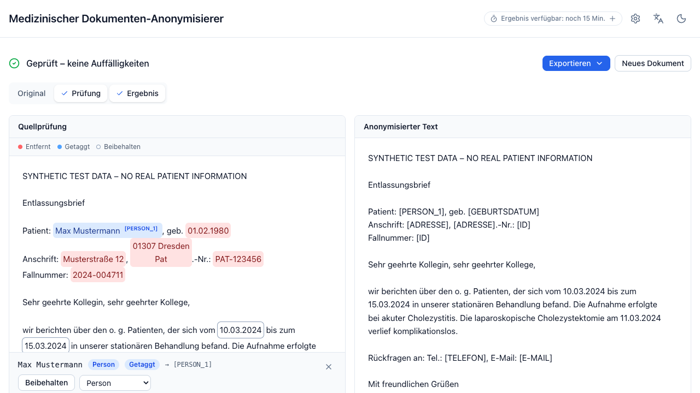
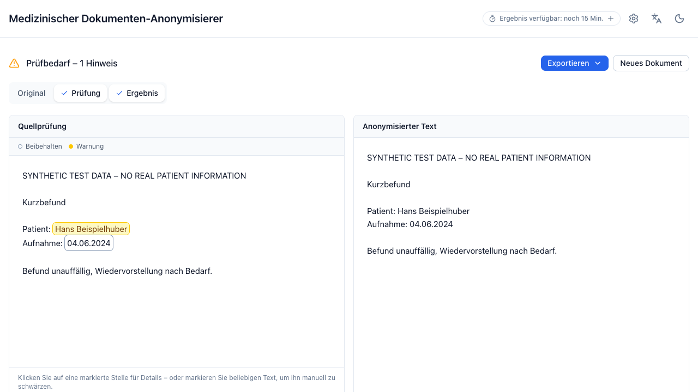
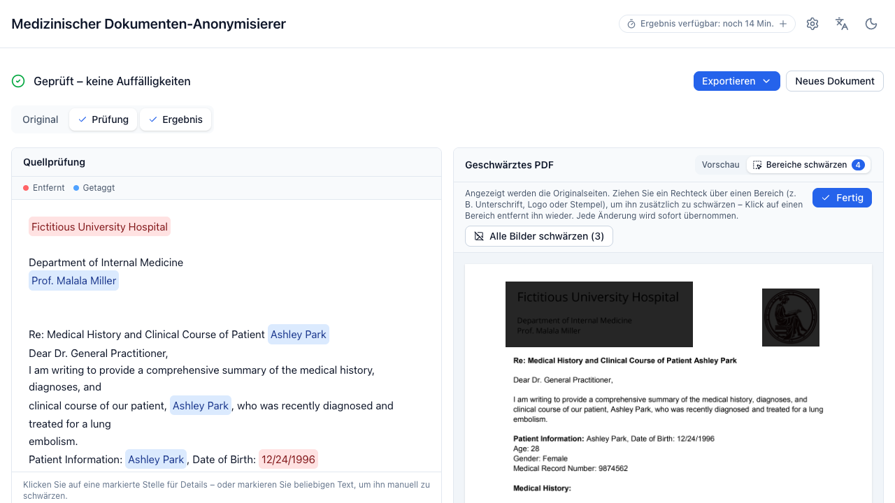

> [!CAUTION]
> **This is an internal evaluation tool.** Its output does **not** establish
> legal anonymization. Results must be reviewed by a human, and anonymization
> quality must be validated locally before any downstream use.

# Medical Document Anonymizer

A locally deployable web app that anonymizes German clinical documents: drop a
document (or paste text), click one button, get anonymized text out — with a
review view showing exactly what was redacted and why.



📖 **[Full documentation](https://katherlab.github.io/deidentifier/)** —
getting started, user guide, operations, evaluation, security, development.

## How it works

No generative model ever rewrites the document. Detectors — rule-based German
recognizers and a prompted LLM behind any OpenAI-compatible endpoint — only
*propose* character spans; deterministic code applies the replacements on the
immutable source text, and an independent leakage-validation pass re-scans the
output and reports `PASS` / `REVIEW_REQUIRED` / `FAIL`.

```text
Document → extraction → rule + LLM detection → span merging
        → deterministic transformation → leakage validation → review UI
```

Pasted text plus `.txt`, `.docx` and `.pdf` uploads; scanned PDFs are detected
and routed to a configured OCR engine. Individual entities can be preserved,
redacted, or retyped in the review UI, and PDFs can be exported with true
blackout redaction. All processing is in memory — nothing is persisted.

## Screenshots

The workflow from a dropped document to a reviewed result, shown with the
synthetic example documents that ship with the repository. Walk through it step
by step in the
**[quickstart](https://katherlab.github.io/deidentifier/getting-started/quickstart/)**.

<table>
  <tr>
    <td width="50%" valign="top">
      
      <p><b>1. Drop or paste</b><br>PDF, DOCX or TXT — several files at once — or paste text straight into the box.</p>
    </td>
    <td width="50%" valign="top">
      
      <p><b>2. Review every redaction</b><br>Each detected entity is highlighted in the source; click one to see its type and replacement.</p>
    </td>
  </tr>
  <tr>
    <td width="50%" valign="top">
      
      <p><b>3. Act on the validation</b><br>An independent leakage pass re-scans the output and flags anything left to check.</p>
    </td>
    <td width="50%" valign="top">
      
      <p><b>4. Black out what is not text</b><br>Logos, stamps and signatures are drawn over on the original pages and burned into the exported PDF, on top of the text redaction.</p>
    </td>
  </tr>
</table>

## Quick start

```bash
cp .env.example .env
docker compose up -d --build     # → http://localhost:8080
```

That starts with rule-based detection and **no external services** — enough to
see the workflow, not enough for real use, since rules alone miss names in
running prose. Uncomment the LLM block in `.env` to add the primary detector;
every variable is documented in that file.

The stack runs in production mode by default (docs disabled, unsafe
configurations refuse to start). The backend has no published port, a read-only
filesystem, and no volumes.

Local development:

```bash
uv sync && npm install
uv run uvicorn backend.src.main:app --reload --host 0.0.0.0 --port 8000
npm run dev                      # → http://localhost:5173
```

See [Installation](https://katherlab.github.io/deidentifier/getting-started/installation/)
and [Configuration](https://katherlab.github.io/deidentifier/operations/configuration/).

## Tests and checks

```bash
uv run ruff check backend/ && uv run ruff format --check backend/
uv run pytest
npm run check && npm test && npm run build
npm run test:e2e                 # Playwright smoke against a fake LLM
```

CI workflows exist but are `workflow_dispatch`-only while the repository is
private — run the commands above locally. See
[Contributing](https://katherlab.github.io/deidentifier/development/contributing/).

## Evaluation

A standalone harness scores the pipeline against annotated ground truth,
reporting document-level leakage alongside character- and span-level metrics:

```bash
uv run python -m backend.src.evaluation.run \
    --input annotations.jsonl --output evaluation-results.json --detectors rules,llm
```

See [Evaluation](https://katherlab.github.io/deidentifier/evaluation/).

## Privacy defaults

- All processing is in memory; nothing is persisted server-side.
- Logs never contain document content (enforced by a safe logger).
- API responses are sent with `Cache-Control: no-store`.
- No analytics, telemetry, CDN, or third-party fonts and scripts.
- All model and OCR backends are configurable base URLs, local by default; the
  UI shows a banner when a configured endpoint is not local.
- The repository contains only clearly marked synthetic example documents.

## Project documents

| File | Purpose |
|---|---|
| [`AGENTS.md`](AGENTS.md) | The canonical codebase guide (architecture, conventions, pitfalls) |
| [`CHANGELOG.md`](CHANGELOG.md) | Release notes |
| [`.github/SECURITY.md`](.github/SECURITY.md) | Vulnerability disclosure policy |
| [`THIRD_PARTY_NOTICES.md`](THIRD_PARTY_NOTICES.md) | Bundled OSS components and licenses |
| [`CITATION.cff`](CITATION.cff) | Citation metadata |

## Citation

Cite the software itself with the metadata in [`CITATION.cff`](CITATION.cff).

The approach it builds on was introduced in the LLM-Anonymizer paper — cite
that too when you refer to the method:

> Wiest IC, Leßmann M-E, Wolf F, Ferber D, Van Treeck M, Zhu J, Ebert MP,
> Westphalen CB, Wermke M, Kather JN. *Deidentifying Medical Documents with
> Local, Privacy-Preserving Large Language Models: The LLM-Anonymizer.* NEJM AI
> 2025;2(4):AIdbp2400537.
> [doi:10.1056/AIdbp2400537](https://doi.org/10.1056/AIdbp2400537)

**This repository is a follow-up, not the code evaluated in that paper.** It is
an independent reimplementation with a different architecture, so the accuracy
reported there does not describe this tool. Measure it on your own documents
with the [evaluation harness](https://katherlab.github.io/deidentifier/evaluation/).

## License

AGPL-3.0-or-later. See [`LICENSE`](LICENSE).
