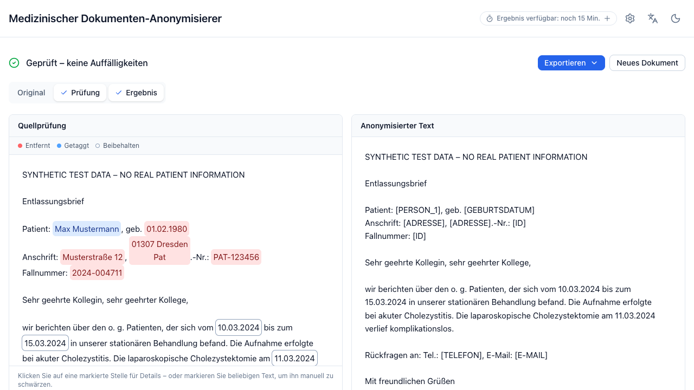

# Quickstart walkthrough

Five minutes, one document, no configuration beyond what
[Installation](installation.md) left you with. Use synthetic text for this —
`backend/tests/files/synthetic_discharge.txt` is exactly what the screenshots
below show.

## 1. Open the app

<figure markdown>
  
  <figcaption>The whole input screen. Nothing to configure — that is the point.</figcaption>
</figure>

Check the header first. A warning chip there means either that a configured
endpoint is **not local** (document content will leave this machine) or that an
enabled detector is **not configured** (it will fail the request rather than
degrade). Click it for the details.

!!! note "Following this on the default configuration"

    With the unedited `.env.example` only the rule detector runs, so this
    walkthrough will find dates, phone numbers and labelled IDs but leave
    names in the prose untouched. That is the configuration behaving
    correctly, not a bug — it is why
    [LLM endpoints](../operations/llm-endpoints.md) is the next step after
    this page.

## 2. Give it a document

Either:

- **Paste text** into the text area, or
- **Drop files** on the dropzone — `.pdf`, `.docx`, `.txt`. Several files at
  once are fine; each becomes its own document and they process in parallel.

Then press **Anonymisieren**. For a scanned PDF this includes OCR, so it can
take a while; the progress card reports the stage it is in.

## 3. Read the result

<figure markdown>
  
</figure>

Three things to look at, in this order:

1. **The status line.** *Geprüft – keine Auffälligkeiten* (PASS),
   *Prüfbedarf* (review required), or *Prüfung fehlgeschlagen* (failed). This
   is the leakage validator's verdict, not a promise —
   [Warnings & validation](../user-guide/validation.md).
2. **Quellprüfung** — the original text with every detected entity marked and
   colour-coded by what happened to it. Colour is always paired with a label.
3. **Ergebnis** — the anonymized text (or the redacted PDF for PDF sources).

## 4. Correct what is wrong

Click any marked passage:

<figure markdown>
  
</figure>

- **Beibehalten** keeps it visible (for example a treating clinic you want in
  the text).
- **Schwärzen** redacts something that was preserved.
- The dropdown corrects a wrong **type** — for example an ID detected as a
  date.
- **Zurücksetzen** undoes your change.

You can also select any text in the source view and redact it manually, even if
no detector found it.

Every change re-runs the deterministic transformation on the server; the
anonymized text and the redacted PDF preview refresh together. The original
document is never modified.

## 5. Export

**Exportieren** offers: copy to clipboard, `.txt`, `.pdf` (PDF sources only),
and — for a batch — all documents as a `.zip`. See
[Exporting](../user-guide/export.md), in particular the note about original
filenames.

## What to do next

- Read [Core concepts](concepts.md) so the validation status and the entity
  types mean something.
- Configure a real detection LLM: [LLM endpoints](../operations/llm-endpoints.md).
- Before trusting it on real data, measure it:
  [Evaluation](../evaluation/index.md).
