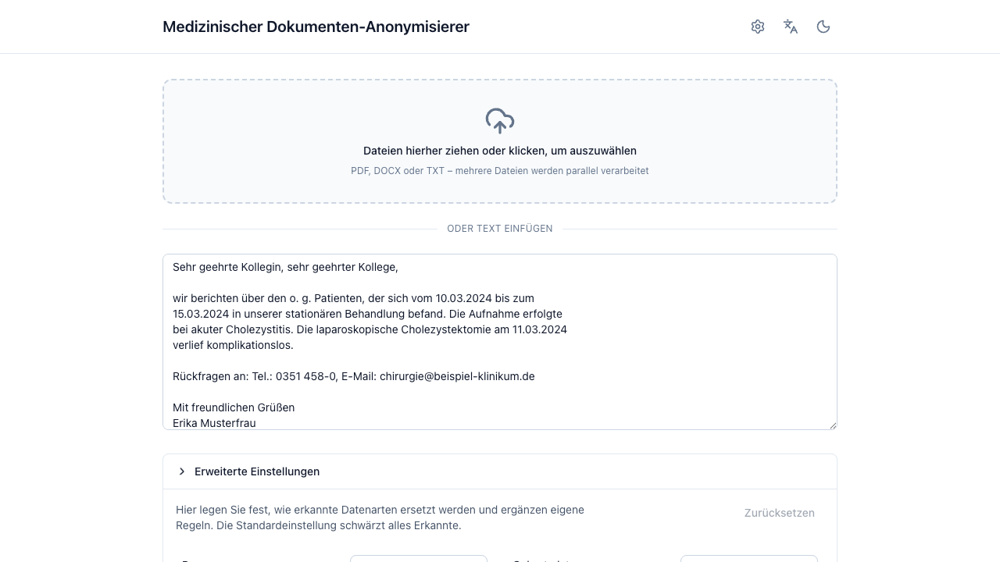
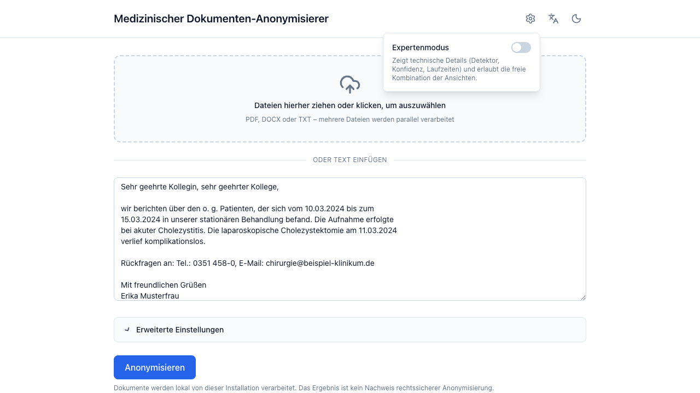

# Advanced settings

Everything on the input screen under **Erweiterte Einstellungen**. It is
collapsed by default and you rarely need it — the defaults are the recommended
configuration.

<figure markdown>
  
</figure>

Settings are captured **once, at submit**, and apply to every document of that
batch — including its re-runs and exports. Changing them afterwards affects the
next run, not the current one. A *angepasst* badge on the section header tells
you the batch deviates from the defaults; **Zurücksetzen** clears everything
back.

## Per-type replacement

One row per entity type, each with the transformations that make sense for it:

| Choice | Effect |
|---|---|
| **Schwärzen** | Replace with the type placeholder, e.g. `[ADRESSE]`. |
| **Konsistente Tags** | Numbered per distinct value: `[PERSON_1]`, `[PERSON_2]`. Names only. |
| **Nur Jahr** | Dates keep their year: `01.02.1980` → `1980`. |
| **Entfernen** | Replace with `[GESCHWÄRZT]` — no hint of what was there. |
| **Beibehalten** | Leave visible. |

The two rows worth thinking about:

- **Datum** defaults to *Beibehalten* so clinical timelines stay usable. Set it
  to *Schwärzen* or *Nur Jahr* when your use case does not need them — dates
  are strong quasi-identifiers in combination with other details.
- **Geburtsdatum** defaults to *Schwärzen*. *Nur Jahr* is the middle ground
  when you need age-adjacent information.

Only your **deviations** are sent to the server; anything you leave alone keeps
its default.

## Eigene Regeln (custom rules)

### Zusätzlich schwärzen

Terms that are **always** redacted, everywhere, regardless of what the LLM
finds — whole words, case-insensitive. This runs as its own deterministic
detector, so it does not depend on model behaviour at all.

Use it for things a general model has no way to know are sensitive: internal
ward names, a study site code, a rare device identifier.

### Nie schwärzen

Detected passages with exactly this wording stay visible.

!!! warning "This reduces protection"

    A term you exempt stays visible in *every* document of the batch, including
    occurrences you did not look at. Prefer a per-entity **Beibehalten** in the
    review view unless you really mean "never, anywhere".

### Zusätzliche Anweisung an die KI-Erkennung

Free text appended to the LLM's detection instructions — for example *"Melde
auch Zimmernummern und Studien-IDs (z. B. NCT-Nummern)."*

It can only **extend or sharpen** detection: the standard instructions, the
rule detectors, and every deterministic check stay active regardless of what
you write. It cannot switch anything off.

Because this changes detection, it takes effect on a full run — not on a
correction in the review view.

## Sprache des Ergebnisses (output language)

The placeholders written into the anonymized document — and the language the AI
re-check phrases its notes in — follow the language selected here. It defaults
to *Wie die Oberfläche*, i.e. whatever the interface is set to.

| Output language | Person | Date of birth | Entfernen |
|---|---|---|---|
| Deutsch | `[PERSON_1]` | `[GEBURTSDATUM]` | `[GESCHWÄRZT]` |
| English | `[PERSON_1]` | `[DATE_OF_BIRTH]` | `[REDACTED]` |
| Français | `[PERSONNE_1]` | `[DATE_DE_NAISSANCE]` | `[CAVIARDE]` |
| Español | `[PERSONA_1]` | `[FECHA_DE_NACIMIENTO]` | `[OCULTADO]` |

Like every other setting here it is **fixed when you press Anonymisieren**.
Switching the interface language while reviewing translates the buttons and
warnings around the document, but never rewrites the document itself:
corrections, re-runs and the PDF export keep the placeholders you already see.
To get a document in a different language, start a new run.

## Texterkennung (OCR)

**OCR-Modell** appears only when the administrator has configured several OCR
models ([profiles](../operations/ocr-engines.md#several-models-at-once-profiles)).
The default is preselected; picking another applies to the next run and stays
with each document, so its corrections and PDF export keep using the same
model. With a single configured model there is nothing to choose and the
picker is hidden.

**OCR erzwingen** appears only when an OCR engine is configured. It skips the
embedded-text probe and re-reads every page of an uploaded PDF via OCR. Use it
for scans whose text layer is missing or garbled. It affects PDF uploads only
and makes processing considerably slower.

## Expert mode

Behind the gear icon in the header:

<figure markdown>
  
</figure>

Expert mode adds diagnostics rather than capability:

- detector name, confidence, applied transformation and character offsets in
  the entity detail bar,
- source type and processing time in the result header,
- severity and category on each validation warning,
- free combination of all four result panels instead of the consolidated
  *Ergebnis* chip.

The preference persists in your browser (it is a UI preference, not document
content).
