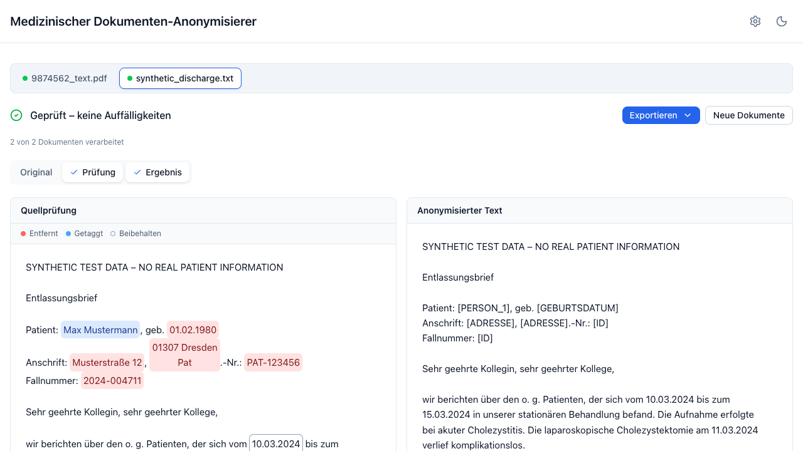

# Anonymizing documents

<figure markdown>
  
</figure>

## Input formats

| Input | Notes |
|---|---|
| Pasted text | Anything you can copy. The fastest path for a quick check. |
| `.txt` | UTF-8 (with or without BOM). Binary content is rejected. |
| `.docx` | Paragraphs, tables, headers and footers. Text boxes, comments and tracked changes are **not** extracted — the app warns you when it finds them. |
| `.pdf` | Native PDFs are read directly. Scanned PDFs are detected and routed to OCR ([OCR engines](../operations/ocr-engines.md)). |

Limits come from the server configuration and are shown in the error message
when you hit one: upload size (20 MB by default) and extracted text length
(500 000 characters by default).

## One document or many

Drop several files at once and each becomes its own document. Up to five
stream in parallel; the rest queue and start as slots free up.

<figure markdown>
  
  <figcaption>The result screen opens as soon as the first document finishes; the rest keep processing in the background.</figcaption>
</figure>

Switch documents with the bar at the top. Each keeps its own result,
corrections, and panel layout. A document that fails gets an error card with a
retry button — the rest of the batch is unaffected.

Pasted text is always a single-document batch, and the paste area is disabled
while files are selected. Remove the files to paste instead.

## Progress

Processing streams its progress, so you see the stage rather than a spinner:

| Stage | Meaning |
|---|---|
| OCR | Page images are being transcribed (scanned PDFs only). Per page, so the bar is meaningful. |
| Erkennung | Detection: rule detectors plus the LLM over the document chunks × passes. |
| Nachprüfung | The LLM re-check of the anonymized output. |

Closing the tab or pressing **Neues Dokument** cancels the in-flight request
server-side.

## Scanned PDFs

A PDF whose pages carry too little extractable text is treated as scanned. What
happens next depends on `OCR_ENGINE`:

- **not configured** — the document is rejected with a clear message. The app
  will not report an empty document as successfully anonymized.
- **configured** — pages are transcribed and the result is marked `PDF (OCR)`.
  The text carries a warning that recognition errors are possible.

For a scanned source, the redacted PDF export is a **reconstruction**: the
anonymized text is laid out at the recognized positions and the original pixels
are discarded. That is deliberate — it is the only way to guarantee nothing
identifying survives in the image. The panel says so.

If a PDF *has* an embedded text layer but the text is garbage (a bad scan
pipeline, or a mixed document), switch on **OCR erzwingen** in the advanced
settings to skip the probe and re-OCR every page.

## Errors you may see

| Message | What it means |
|---|---|
| *Dateityp nicht unterstützt* | Only `.txt`, `.docx`, `.pdf` are accepted. |
| *Datei zu groß* | Above the configured upload limit. |
| *Dieses PDF scheint gescannt zu sein. OCR ist nicht aktiviert.* | Ask your administrator to configure an OCR engine. |
| *Der KI-Erkennungsdienst ist nicht erreichbar. Das Dokument wurde NICHT anonymisiert.* | The LLM endpoint is down or misconfigured. Nothing partial is returned — by design. |
| *Ergebnis abgelaufen – wird neu berechnet* | The 15-minute in-memory cache expired; the app re-sends the source automatically. |

More detail in [Troubleshooting](../operations/troubleshooting.md).
