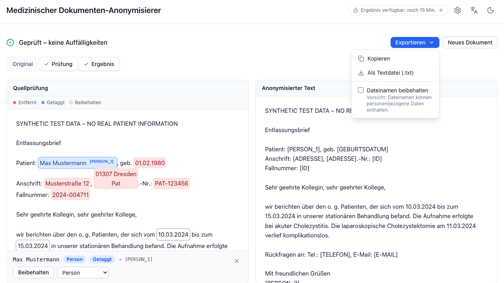

# Exporting

**Exportieren** always acts on the anonymized result — including every
correction you made — regardless of which panels are visible.

<figure markdown>
  
</figure>

| Option | Available for | Produces |
|---|---|---|
| **Kopieren** | everything | The anonymized text on your clipboard. |
| **Als Textdatei (.txt)** | everything | `anonymisiert.txt`, UTF-8. |
| **Als PDF** | PDF uploads | A redacted PDF. |
| **Alle Dokumente (.zip)** | batches | Every finished document of the batch, in the format that fits each one. |

## Redacted PDF

Two different paths, chosen by how the source was read:

**Native PDF** — the original file is redacted in place: the character boxes of
every redacted passage are blacked out and the underlying text is removed, so
the content cannot be recovered by copy-paste or text extraction. Layout,
images, and formatting stay intact.

**Scanned PDF (`PDF (OCR)`)** — the original pixels are **discarded** and the
document is rebuilt from the anonymized text at the recognized line positions.
The result carries a *"Maschinell rekonstruiertes und anonymisiertes Dokument"*
notice. Layout is approximate. This is deliberate: an image cannot be verified
to be free of identifying pixels, so it is not shipped.

Both paths **fail closed**. If the redaction cannot be verified afterwards, the
export is refused with an error rather than handing you a file that looks
redacted but is not.

Any [areas you blacked out](review.md#blacking-out-areas-of-a-pdf) are applied
on top, in both paths.

!!! note "The original file is re-sent"

    Nothing is stored on the server, so the browser uploads the original PDF
    again for the export. When it matches the document you just anonymized, the
    server reuses its cached detection — no second OCR or LLM run. After the
    cache expires the export takes as long as the original run.

## Filenames

By default every export is named after the document's
[output language](advanced-settings.md#sprache-des-ergebnisses-output-language)
— `anonymisiert.*` for a German run, `anonymized.*`, `anonymise.*` or
`anonimizado.*` for the others — and the ZIP numbers its entries. The file
belongs to the document, so switching the interface language afterwards does
not rename it.

**Dateinamen beibehalten** in the export menu keeps the original filenames
instead. Convenient for a large batch — and a real risk: filenames routinely
contain patient names, birth dates, and case numbers, none of which the tool
can redact. Turning it on means you take responsibility for the filenames.

## After the export

The export is where the tool's job ends and yours begins:

- **Read the output.** Especially when the status was *Prüfbedarf*.
- **Check the filename** if you kept the original names.
- **Remember what is preserved by policy** — clinical dates by default, plus
  anything you chose to keep. Individually harmless, they can identify a person
  in combination.
- **Nothing is logged or kept** on the server. If you lose the file, the
  document has to be processed again.
