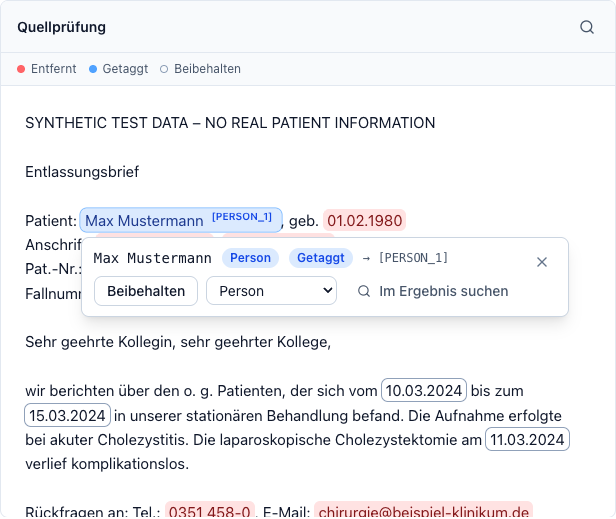
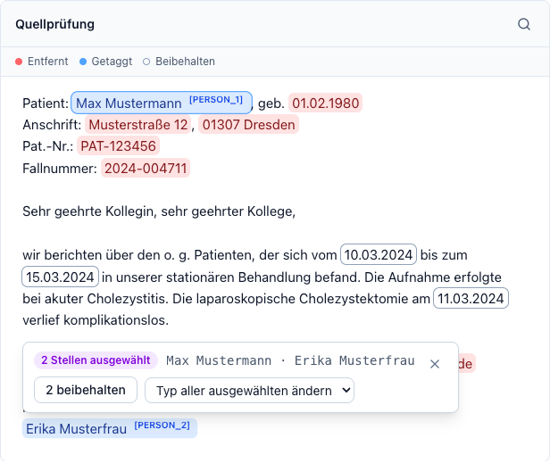

# Reviewing the result

The result screen is where the tool earns its keep: it shows you exactly what
was redacted, why, and lets you correct it.

<figure markdown>
  
</figure>

## The header

- **Status** — the leakage validator's verdict
  ([Warnings & validation](validation.md)).
- **Exportieren** — always acts on the anonymized result, whichever panels are
  visible ([Exporting](export.md)).
- **Neues Dokument** — discards everything and returns to the input screen.

## How long the result stays available

While you review, the server keeps the detected entities and the extracted text
in memory so every correction is instant instead of a fresh model run. The
**Ergebnis verfügbar: noch m:ss** chip in the top bar shows how much of that
window is left — **15 minutes** from when the result appeared.

That chip is also a button: press it at any time and the result is yours for
**another hour**, counted from the press. Do it before you step away rather
than after; a toast confirms the new time. One press covers every document of
the batch, since their windows run together, and you can press it as often as
you need.

If the time does run low, a warning appears above the panels with the same
**Verlängern** button. No result is held longer than **12 hours** after it was
produced; from then on the chip reports that the maximum has been reached.

!!! note "Your deployment may differ"

    All three durations are set by whoever runs the app
    ([Configuration](../operations/configuration.md)), so a stricter site may
    show shorter windows.

Letting it expire costs nothing but time: your corrections stay in the browser,
and the next change re-runs the anonymization from the text your browser still
holds. Pressing **Neues Dokument**, closing a document, or closing the tab
deletes the server-side copy immediately — see
[Data retention](../DATA_RETENTION.md).

## The panels

Chips above the panels toggle up to three views side by side:

| Chip | Panel |
|---|---|
| **Original** | The untouched upload (PDF sources render the original file) or the extracted source text. |
| **Prüfung** | *Quellprüfung* — the source text with entities highlighted. The main working view. |
| **Ergebnis** | The anonymized text, or the redacted PDF for PDF sources. |

In [expert mode](advanced-settings.md#expert-mode) the redacted PDF and the
anonymized text become separate chips, so you can show both at once.

## Searching inside a panel

Each text panel has a magnifier in its header, and `Ctrl+F` (`Cmd+F` on a Mac)
opens the search **in the panel you last worked in** — so the final check is one
shortcut away from wherever you are reading. `Enter` and `Shift+Enter` step
through the hits, `Esc` closes the bar. Every hit is marked in the text and the
counter shows which one you are on.

The search ignores case and diacritics, so `muller` finds *Müller*. Each panel
searches on its own; opening the search in one leaves the others untouched.

The point of it is the last check before you export: search a name in the
**Ergebnis** panel and read the counter. **Kein Treffer** means that string does
not occur in the anonymized text. A selected find offers this in one click —
**Im Ergebnis suchen** puts its text straight into the anonymized text's search,
switching the result panel to that view if the redacted PDF was showing.

!!! warning "What a hit count is, and is not"

    It is a statement about **one string in one panel's text**, nothing more. A
    name spelled differently, split across a line break, or mangled by OCR does
    not turn up — "Kein Treffer" is not a proof of anonymization
    ([Warnings & validation](validation.md)).

!!! note "PDF views have no search of their own"

    A PDF is rendered by the browser's own viewer, which this app can neither
    search nor highlight in — so the **Original** panel of a PDF source and the
    **Geschwärztes PDF** panel carry no magnifier, and the shortcut skips them
    for the nearest text panel. To search the pages themselves, click into the
    PDF and use the viewer's own find function.

## Reading the highlights

<figure markdown>
  
</figure>

Each mark is coloured by what happened to it, and the legend above the text
names the statuses actually present in this document — colour is never the only
signal:

| Status | Meaning |
|---|---|
| **Entfernt** | Replaced by a placeholder such as `[ADRESSE]`. |
| **Getaggt** | Replaced by a consistent tag such as `[PERSON_1]` — the same person carries the same number throughout. |
| **Verallgemeinert** | Reduced, e.g. a date to its year. |
| **Beibehalten** | Left visible, either by policy (clinical dates) or by your decision. |

A small purple dot marks an entity you changed. A yellow highlight is not an
entity at all — it is a passage a **validation warning** points at.

The counts under the panels (`Person 3 · Adresse 2 · …`) are clickable: each
click jumps to the next occurrence of that type.

## Correcting an entity

Click a mark and its details and actions appear right next to it, so you never
have to look away from the passage you are judging:

<figure markdown>
  
</figure>

| Action | Effect |
|---|---|
| **Beibehalten** | Keep this passage visible. |
| **Schwärzen** | Redact a passage that was preserved. |
| **Im Ergebnis suchen** | Look this text up in the anonymized text — see [Searching inside a panel](#searching-inside-a-panel). |
| Type dropdown | Correct a wrong type — the new type's transformation applies immediately. |
| **Zurücksetzen** | Undo your change for this entity. |

Every change re-runs the transformation **on the server** from the cached
detection: the anonymized text and the redacted-PDF preview refresh together,
and the original document is never modified. Corrections are per occurrence,
not per string — see below for changing several at once.

## Correcting several finds at once

Fixing the same thing fifteen times is the wrong kind of work. Three gestures
build a selection in the *Quellprüfung* panel:

| Gesture | Effect |
|---|---|
| **Click** | Select this find alone (the details, as above). |
| **Ctrl-click** (**Cmd-click** on a Mac) | Add a find to the selection, or take it back out. |
| **Shift-click** | Select everything between the last find you clicked and this one — a whole letterhead or address block in two clicks. |

The marks work as buttons, so `Tab` walks between them and `Enter` — with
`Ctrl` or `Shift` held — does the same thing without a mouse. `Esc` clears the
selection.

There is also a shortcut for the most common case: when a name occurs more than
once, a single find offers **Alle N Vorkommen wählen**.

From two selected finds on, the details give way to the selection actions —
still anchored to the last mark you touched. They name what you have selected
and offer the same choices for all of it: **N schwärzen**, **N beibehalten**, a
type dropdown, and **N zurücksetzen**.

<figure markdown>
  
</figure>

Each button reports how many finds it would actually change, and the counts
differ on purpose — **N schwärzen** only touches finds that are currently
preserved, so a consistent `[PERSON_1]` tag is never flattened into a plain
`[NAME]` as a side effect.

The whole selection costs **one** re-run, not one per find, and it survives
that re-run: preserve six names, look at the output, and press **6 schwärzen**
to take it back without re-selecting anything.

!!! note "Keeping one of several identical passages, in a PDF"

    The redacted PDF finds what to black out by searching for the redacted
    text, so keeping a single occurrence of a repeated name cannot show through
    there — only in the text export. A note above the **Geschwärztes PDF**
    panel appears when that happens; keeping **all** occurrences (the shortcut
    above) resolves it. See [Exporting](export.md#redacted-pdf).

!!! warning "Keeping several finds is the direction that can leak"

    **N beibehalten** puts every selected passage back into the output. That is
    the one bulk action that can return an identifier to a document, so the bar
    spells out the texts it is about to release and a message confirms how many
    were kept. Read the list before you press it.

!!! note "The LLM re-check does not repeat"

    The final LLM audit runs on the full run only. After a correction you get
    an informational note saying so. Press **Neues Dokument** and re-run if
    you want a fresh audit of the corrected output.

## Redacting something no detector found

Select any text in the *Quellprüfung* panel and a **Schwärzen** pill appears at
the end of the selection. The selected span becomes a first-class entity
(marked as *Manuelle Schwärzung*), goes through the same overlap resolution as
everything else, and applies to the export.

This is the right tool for the things detectors are weakest at: an unusual
identifier, a distinctive free-text detail, a nickname.

For a term that occurs many times — or that you want redacted in *every*
document of a batch — use *Immer schwärzen* in the
[advanced settings](advanced-settings.md) instead.

## Blacking out areas of a PDF

Signatures, letterheads, stamps, and photos are pixels, not text, so no text
detector can find them. The **Geschwärztes PDF** panel has two views: switch it
from **Vorschau** to **Bereiche schwärzen** and drag a rectangle over anything
that should be covered:

<figure markdown>
  
</figure>

The editor draws on the pages of the **redacted preview**, so everything the
detectors already caught is blacked out while you add what they missed.
**Originalseiten anzeigen** switches the background to the unredacted pages —
useful when a black bar sits on top of what you are trying to cover —
and **Schwärzungen anzeigen** switches back.

- Click an existing rectangle to remove it. Against the redacted background,
  your own areas are the ones outlined in white.
- The background follows every change: each drawn area regenerates the redacted
  preview, and the pages catch up a moment later.
- **Scanned documents draw on the reconstruction.** Their export is not the
  scan: the original pixels are discarded and the anonymized text is re-typeset
  at the OCR positions, so the editor shows that reconstruction — the page the
  areas are really applied to — and there is nothing to switch. The scan itself
  stays available in the **Original** panel.
- **Fertig** (or the **Vorschau** view) takes you back to the redacted preview;
  every change applies immediately, so nothing is lost either way.
- **Alle Bilder schwärzen** covers every embedded image the backend found, in
  one click.
- Areas apply to the redacted-PDF preview and export only; text exports are
  unaffected.
- An area is a **true redaction**, not a black rectangle drawn on top: the text
  and image pixels under it are removed from the exported PDF, and an export
  that cannot prove that is refused.
