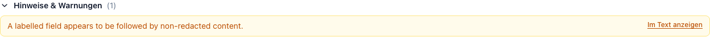

# Warnings & validation

After the transformation, an **independent pass re-scans the anonymized
output**. It never edits anything — it only reports. That report is the status
line at the top of the result.

<figure markdown>
  
</figure>

## The three statuses

| Status | Shown as | Meaning | What to do |
|---|---|---|---|
| `PASS` | *Geprüft – keine Auffälligkeiten* | No warning above informational level. | Still read the output. A passed check means nothing suspicious was **found**, not that nothing was missed. |
| `REVIEW_REQUIRED` | *Prüfbedarf – N Hinweise* | At least one warning. | Work through the list; each locatable warning links into the source. |
| `FAIL` | *Prüfung fehlgeschlagen* | Something critical: text that should have been redacted still appears in the output. | Do not use this output. Report it — a `FAIL` usually indicates a bug or a pathological document. |

## What the validator checks

1. **Residual identifiers.** Every non-preserved entity's original text must
   not appear anywhere in the output. A hit here is `HIGH` severity and fails
   the document.
2. **Rule re-detection.** The rule detectors run again on the output. Anything
   they still find — an e-mail, a phone number, a labelled ID — becomes a
   warning.
3. **Labelled fields.** `Patient:`, `Name:`, `Anschrift:`, `Adresse:`,
   `Wohnhaft:` followed by something that is not a placeholder. This is the
   check that most often catches a name the detectors missed entirely.
4. **The LLM audit** (when enabled). The model reads the anonymized output with
   an auditing prompt and reports what personal data it still sees, plus an
   overall re-identification risk. Placeholders, preserved dates and bare years
   are excluded so it does not report its own output back.
5. **Detector problems.** If a detector reported a mention that could not be
   located in the source, or produced a span that failed verification, that
   becomes a warning too — the document may not have been checked completely.

## Reading the list

<figure markdown>
  
</figure>

**Hinweise & Warnungen** is expanded automatically whenever the status is not
`PASS`. Warnings are colour-coded by severity, and those that point at a
position offer **Im Text anzeigen**, which scrolls the source panel to the spot
and highlights it in yellow.

Blue items at the bottom are general processing notes rather than validation
findings — for example that page mapping is unavailable, that OCR was used, or
that the LLM re-check was not repeated after a correction.

In [expert mode](advanced-settings.md#expert-mode) each warning also shows its
severity and its category slug (`residual_identifier`, `revalidation_hit`,
`labelled_field`, `llm_recheck`, `detector`), which is what you quote in a bug
report.

## Common warnings

| Warning | Usual cause | Response |
|---|---|---|
| *A labelled field appears to be followed by non-redacted content* | A name the detectors missed, or a field the policy deliberately preserves. | Look at the spot. Redact it manually if it is an identifier. |
| *A rule detector still finds a possible … in the output* | An identifier in an unusual format, or one you preserved on purpose. | Check whether the preservation was intended. |
| *Redacted … content appears to remain in the output* | A genuine bug or a pathological overlap. | Do not use the output; report it with the document type (never the document). |
| *The LLM re-check was not repeated for this adjusted result* | Informational — you corrected an entity after the audit ran. | Re-run from scratch if you want a fresh audit. |
| *Text was produced by OCR; recognition errors are possible* | Informational, on every scanned document. | Bad OCR hides identifiers from detection. Skim the source panel for garbled passages. |

## The limits of this check

The validator is a **second opinion on the output**, not an independent
detector on the input. It cannot find an identifier that no detector
recognized *and* that sits in no labelled field and matches no rule — for
example a bare surname in running prose.

That is why `PASS` means "nothing suspicious was found", human review is
required, and the honest way to know how well the pipeline performs on your
documents is to measure it: [Evaluation](../evaluation/index.md).
